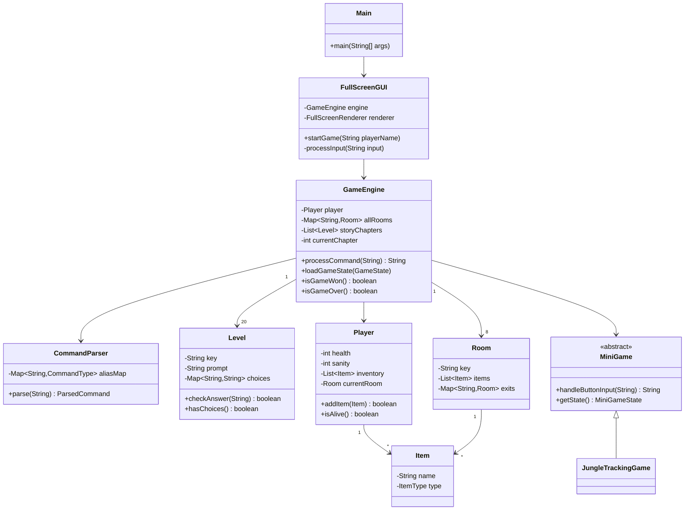
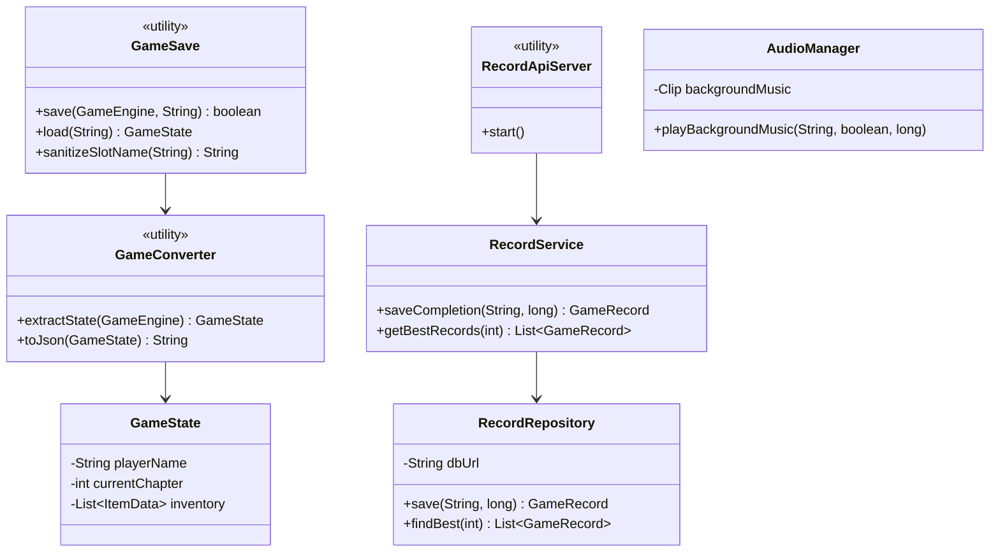

# LOST — Relazione del progetto

Progetto per l'esame di Metodi Avanzati di Programmazione.

Autore: **Elia Sakellarides** (progetto individuale)

---

## Indice

1. [Introduzione](#1-introduzione)
   - 1.1 [Trama](#11-trama)
   - 1.2 [Caratteristiche principali](#12-caratteristiche-principali)
   - 1.3 [Struttura del progetto](#13-struttura-del-progetto)
2. [Progettazione](#2-progettazione)
   - 2.1 [Architettura generale](#21-architettura-generale)
   - 2.2 [Diagramma delle classi](#22-diagramma-delle-classi)
   - 2.3 [Descrizione delle classi principali](#23-descrizione-delle-classi-principali)
3. [Specifiche algebriche](#3-specifiche-algebriche)
   - 3.1 [Specifica algebrica della Lista](#31-specifica-algebrica-della-lista)
   - 3.2 [Specifica algebrica del Dizionario](#32-specifica-algebrica-del-dizionario)
4. [Applicazione argomenti del corso](#4-applicazione-argomenti-del-corso)
   - 4.1 [Programmazione orientata agli oggetti](#41-programmazione-orientata-agli-oggetti)
   - 4.2 [File](#42-file)
   - 4.3 [Database](#43-database)
   - 4.4 [REST](#44-rest)
   - 4.5 [Thread](#45-thread)
   - 4.6 [Lambda expressions](#46-lambda-expressions)
   - 4.7 [GUI Swing](#47-gui-swing)
   - 4.8 [Il parser](#48-il-parser)
5. [Test](#5-test)
6. [Walkthrough](#6-walkthrough)
7. [Compilazione ed esecuzione](#7-compilazione-ed-esecuzione)

---

# 1. Introduzione

LOST è un'avventura grafico-testuale in Java ispirata all'omonima serie TV.
Il giocatore interpreta un sopravvissuto del volo Oceanic 815, precipitato su
un'isola misteriosa del Pacifico. L'interfaccia combina la tradizione delle
avventure testuali (parser di comandi, inventario, enigmi basati su oggetti)
con una presentazione grafica: immagini di scena per ogni capitolo, font
retrò, testo colorato e colonna sonora.

## 1.1 Trama

Il volo Oceanic 815 si spezza in volo e precipita su un'isola sconosciuta.

Nel corso di 20 capitoli il giocatore deve sopravvivere alla prima notte,
affrontare il Mostro di Fumo, scoprire le stazioni della DHARMA Initiative,
diffidare degli Altri, riparare una radio danneggiata e infine recuperare
una **mappa DHARMA** con le coordinate di una pista di atterraggio nascosta:
l'unica via per lasciare l'isola a bordo di un piccolo aereo.

## 1.2 Caratteristiche principali

- **20 capitoli narrativi** con scelte multiple (A/B/C) e risposte libere
- **8 locazioni** visitabili nel corso della storia (Spiaggia, Giungla,
  Botola/Il Cigno, Villaggio degli Altri, Tempio, Roccia Nera, Faro, Pista)
- **Parser di comandi** con alias multilingua (italiano/inglese) e
  abbreviazioni rapide
- **Movimento libero** tra le locazioni (`vai nord/sud/est/ovest`):
  gli oggetti dimenticati si possono recuperare tornando sui propri passi
- **Enigma a oggetti**: la riparazione della radio del cockpit
  (batteria + cavo antenna + fusibile)
- **Minigioco** di tracciamento nella giungla integrato nella storia
- **Game over**: la salute del giocatore può azzerarsi (scelte sbagliate,
  dinamite innescata) e termina la partita
- **Salvataggio/caricamento** su file JSON con slot multipli
- **Classifica dei migliori tempi** su database H2 locale
- **API REST** locale per consultare e inserire record
- **Interfaccia Swing** fullscreen con sequenza introduttiva animata,
  testo colorato HTML e colonna sonora

## 1.3 Struttura del progetto

```
Lost/
├── pom.xml                  # Build Maven (jar-with-dependencies)
├── scripts/                 # Compilazione/test/avvio senza Maven
├── docs/                    # Documentazione
└── src/
    ├── main/
    │   ├── java/com/lost/
    │   │   ├── Main.java    # Entry point
    │   │   ├── engine/      # Motore di gioco, parser, capitoli
    │   │   ├── model/       # Player, Room, Item
    │   │   ├── gui/         # Interfaccia Swing
    │   │   ├── graphics/    # Rendering, immagini, font, colori
    │   │   ├── audio/       # Riproduzione musica
    │   │   ├── minigames/   # Minigioco di tracciamento
    │   │   ├── save/        # Serializzazione JSON dello stato
    │   │   └── records/     # Classifica: H2 + API REST
    │   └── resources/       # Immagini, musica, font
    └── test/java/com/lost/  # Smoke test automatizzati
```

#### [Ritorna all'indice](#indice)

---

# 2. Progettazione

## 2.1 Architettura generale

L'architettura separa nettamente tre responsabilità:

1. **Il motore di gioco** (`engine`, `model`, `minigames`): logica pura,
   nessuna dipendenza da Swing. Riceve stringhe di comando e restituisce
   stringhe di risposta. Questa separazione permette di testare l'intero
   gioco senza interfaccia grafica (vedi [Test](#5-test)).
2. **La presentazione** (`gui`, `graphics`, `audio`): la GUI interroga il
   motore e si occupa solo di visualizzare lo stato corrente.
3. **I servizi** (`save`, `records`): persistenza su file JSON e database
   H2, esposti anche via API REST.

## 2.2 Diagramma delle classi

Diagramma del nucleo di gioco:



Diagramma dei servizi (persistenza, classifica, audio):



## 2.3 Descrizione delle classi principali

| Classe | Responsabilità |
|---|---|
| `GameEngine` | Cuore del gioco: gestisce la progressione tra i 20 capitoli, il mondo (stanze e oggetti), i timer di gioco, il game over e la vittoria. |
| `CommandParser` | Traduce l'input dell'utente in un `CommandType` canonico tramite una mappa di alias (sinonimi italiani, inglesi e abbreviazioni). |
| `Level` | Un capitolo della storia: testo, scelte multiple o risposte libere accettate, suggerimento, eventuale minigioco collegato. |
| `Player` | Stato del giocatore: salute, sanità mentale, giorni sull'isola, inventario, stanza corrente. |
| `Room` / `Item` | Il modello del mondo: stanze collegate tra loro e oggetti raccoglibili con tipo ed effetto. |
| `MiniGame` | Classe astratta per i minigiochi; `JungleTrackingGame` la implementa per la caccia al cinghiale. |
| `FullScreenGUI` | Finestra principale Swing: pannello immagine, area testo HTML, pulsanti A/B/C, dialoghi di salvataggio/caricamento/record. |
| `GameSave` / `GameConverter` / `GameState` | Serializzazione completa dello stato di gioco in JSON (Gson) negli slot in `~/.lost/saves/`. |
| `RecordRepository` / `RecordService` | Accesso al database H2 dei record (migliori tempi di completamento). |
| `RecordApiServer` | Espone i record via HTTP/REST su `localhost:8000`. |
| `AudioManager` | Riproduzione asincrona della colonna sonora con fade-out temporizzato. |

#### [Ritorna all'indice](#indice)

---

# 3. Specifiche algebriche

Nel progetto le due strutture dati più utilizzate sono la **Lista**
(l'inventario del giocatore, gli oggetti in una stanza, l'elenco dei
capitoli) e il **Dizionario/Mappa** (le stanze dell'isola indicizzate per
chiave, gli alias del parser, le immagini di scena). Di seguito le loro
specifiche algebriche.

## 3.1 Specifica algebrica della Lista

Usata ad esempio per l'inventario (`List<Item>` in `Player`) e per i
capitoli della storia (`List<Level>` in `GameEngine`).

### Specifica sintattica

**Sorts:** `List`, `Item`, `Integer`, `Boolean`

| Operazione | Tipo |
|---|---|
| `newList` | `→ List` |
| `add` | `List × Item → List` |
| `remove` | `List × Integer → List` |
| `get` | `List × Integer → Item` |
| `size` | `List → Integer` |
| `isEmpty` | `List → Boolean` |
| `contains` | `List × Item → Boolean` |

### Costruttori e osservazioni

I costruttori della specifica sono `newList` e `add`; tutte le altre
operazioni sono osservazioni, definite per induzione sui costruttori.

| Osservazione | `newList` | `add(l, i)` |
|---|---|---|
| `isEmpty` | `true` | `false` |
| `size` | `0` | `size(l) + 1` |
| `contains(_, j)` | `false` | `if i = j then true else contains(l, j)` |
| `get(_, n)` | `error` | `if n = size(l) then i else get(l, n)` |
| `remove(_, n)` | `error` | `if n = size(l) then l else add(remove(l, n), i)` |

### Specifica semantica

```text
isEmpty(newList) = true
isEmpty(add(l, i)) = false

size(newList) = 0
size(add(l, i)) = size(l) + 1

contains(newList, j) = false
contains(add(l, i), j) = if i = j then true else contains(l, j)

get(add(l, i), n) = if n = size(l) then i else get(l, n)

remove(add(l, i), n) = if n = size(l) then l else add(remove(l, n), i)
```

### Specifica di restrizione

```text
get(newList, n) = error
remove(newList, n) = error
get(add(l, i), n) = error            se n < 0 ∨ n > size(l)
remove(add(l, i), n) = error         se n < 0 ∨ n > size(l)
```

## 3.2 Specifica algebrica del Dizionario

Usato ad esempio per la mappa dell'isola (`Map<String, Room>` in
`GameEngine`) e per gli alias dei comandi (`Map<String, CommandType>` in
`CommandParser`).

### Specifica sintattica

**Sorts:** `Map`, `Key`, `Value`, `Integer`, `Boolean`

| Operazione | Tipo |
|---|---|
| `newMap` | `→ Map` |
| `put` | `Map × Key × Value → Map` |
| `get` | `Map × Key → Value` |
| `containsKey` | `Map × Key → Boolean` |
| `removeKey` | `Map × Key → Map` |
| `size` | `Map → Integer` |
| `isEmpty` | `Map → Boolean` |

### Costruttori e osservazioni

I costruttori sono `newMap` e `put`; le altre operazioni sono osservazioni.

| Osservazione | `newMap` | `put(m, k, v)` |
|---|---|---|
| `isEmpty` | `true` | `false` |
| `size` | `0` | `if containsKey(m, k) then size(m) else size(m) + 1` |
| `containsKey(_, j)` | `false` | `if k = j then true else containsKey(m, j)` |
| `get(_, j)` | `error` | `if k = j then v else get(m, j)` |
| `removeKey(_, j)` | `error` | `if k = j then removeKey(m, j) else put(removeKey(m, j), k, v)` |

### Specifica semantica

```text
isEmpty(newMap) = true
isEmpty(put(m, k, v)) = false

size(newMap) = 0
size(put(m, k, v)) = if containsKey(m, k) then size(m) else size(m) + 1

containsKey(newMap, j) = false
containsKey(put(m, k, v), j) = if k = j then true else containsKey(m, j)

get(put(m, k, v), j) = if k = j then v else get(m, j)

removeKey(put(m, k, v), j) = if k = j then removeKey(m, j)
                             else put(removeKey(m, j), k, v)
```

### Specifica di restrizione

```text
get(newMap, j) = error
removeKey(newMap, j) = error
get(put(m, k, v), j) = error         se containsKey(put(m, k, v), j) = false
```

#### [Ritorna all'indice](#indice)

---

# 4. Applicazione argomenti del corso

## 4.1 Programmazione orientata agli oggetti

Il progetto usa i principali costrutti OOP visti a lezione:

- **Incapsulamento**: lo stato di `Player`, `GameEngine` e `Level` è privato
  ed esposto solo tramite metodi; la GUI non può alterare direttamente la
  progressione della storia.
- **Ereditarietà e polimorfismo**: `MiniGame` è la classe astratta dei
  minigiochi; `GameEngine` interagisce solo con l'interfaccia astratta
  (`handleButtonInput`, `getState`) senza conoscere l'implementazione
  concreta (`JungleTrackingGame`).
- **Enumerazioni**: `CommandType` (i comandi riconosciuti), `Item.ItemType`
  (cibo, medicina, strumento, documento...), `MiniGameState`.
- **Classi statiche di utilità**: `GameSave`, `GameConverter`,
  `RecordApiServer` espongono solo metodi statici e non sono istanziabili.
- **Classi annidate**: `CommandParser.ParsedCommand` (risultato del parsing)
  e `FullScreenGUI.GamePanel` (pannello di rendering custom).

## 4.2 File

I file sono usati in tre punti del progetto:

**1. Salvataggio e caricamento delle partite.** Lo stato completo del gioco
(giocatore, inventario, oggetti nelle stanze, capitolo corrente, flag degli
enigmi) viene serializzato in JSON con **Gson** e scritto in
`~/.lost/saves/<slot>.json`, accompagnato da un indice `index.json`:

```java
GameState state = GameConverter.extractState(engine);
String json = GameConverter.toJson(state);
Path saveFile = resolveSlotFile(SAVE_DIR, safeSlotName);
Files.writeString(saveFile, json);
```

Il nome dello slot viene **sanitizzato** (`sanitizeSlotName`) e il percorso
risultante viene validato per impedire attacchi di *path traversal*
(es. `salva ../../altro`):

```java
private static Path resolveSlotFile(Path saveDir, String slotName) {
    Path normalizedDir = saveDir.toAbsolutePath().normalize();
    Path file = normalizedDir.resolve(slotName + ".json").normalize();
    if (!file.startsWith(normalizedDir)) {
        throw new IllegalArgumentException("Slot salvataggio non valido");
    }
    return file;
}
```

**2. Risorse dal classpath.** Immagini, musica e font sono impacchettati
nel JAR e caricati con `getResourceAsStream`, così il gioco funziona
indipendentemente dalla directory di lavoro:

```java
try (InputStream is = getClass().getResourceAsStream("/images/" + filename)) {
    if (is != null) {
        BufferedImage original = ImageIO.read(is);
        ...
    }
}
```

**3. Il database H2** persiste su file in `~/.lost/records.mv.db`
(vedi sezione successiva).

## 4.3 Database

La classifica dei migliori tempi di completamento è salvata su un database
**H2** locale (`jdbc:h2:file:~/.lost/records`). La classe
`RecordRepository` incapsula tutto l'accesso JDBC: creazione della tabella
al primo avvio, inserimento e interrogazioni con `PreparedStatement` (mai
concatenazione di stringhe, contro SQL injection) e chiusura automatica
delle risorse con *try-with-resources*:

```java
public List<GameRecord> findBest(int limit) {
    String sql = "SELECT id, player_name, completion_millis, completed_at " +
        "FROM records ORDER BY completion_millis ASC, completed_at ASC LIMIT ?";
    List<GameRecord> records = new ArrayList<>();
    try (Connection connection = openConnection();
         PreparedStatement statement = connection.prepareStatement(sql)) {
        statement.setInt(1, limit);
        try (ResultSet rs = statement.executeQuery()) {
            while (rs.next()) {
                records.add(fromResultSet(rs));
            }
        }
    } catch (SQLException e) {
        throw new IllegalStateException("Impossibile leggere i record", e);
    }
    return records;
}
```

L'URL del database è configurabile via *system property*
(`lost.records.db.url`): gli smoke test la usano per lavorare su un
database H2 **in memoria** senza toccare i dati reali.

## 4.4 REST

All'avvio il gioco apre una piccola **API REST** locale
(`RecordApiServer`, su `com.sun.net.httpserver.HttpServer`) che espone la
classifica in JSON:

| Endpoint | Metodo | Risposta |
|---|---|---|
| `/records` | GET | Tutti i record |
| `/records` | POST | Inserisce un record (body JSON) |
| `/records/best` | GET | I 5 migliori tempi |

Il server gestisce i codici di stato HTTP appropriati (200, 201, 400 per
JSON malformato, 405 per metodi non supportati) e serializza con Gson:

```java
server.createContext("/records/best", exchange ->
    handleList(exchange, service.getBestRecords(5)));
```

Se la porta 8000 è occupata, il gioco prosegue senza API (degrado
controllato).

## 4.5 Thread

Il progetto usa thread in tre punti:

**1. Fade-out musicale** (`AudioManager`): la sigla iniziale suona per 15
secondi e poi sfuma. L'attesa e la riduzione graduale del volume avvengono
su **thread daemon** dedicati, per non bloccare l'Event Dispatch Thread di
Swing:

```java
private void startDaemonThread(Runnable task, String name) {
    Thread thread = new Thread(task, name);
    thread.setDaemon(true);
    thread.start();
}
```

**2. Il server REST** gira su un executor a singolo thread daemon
(`Executors.newSingleThreadExecutor`), così le richieste HTTP non
interferiscono con il gioco e il processo può terminare liberamente.

**3. Swing Timer**: l'aggiornamento periodico del pannello di stato
(`statusUpdateTimer`, ogni 500 ms) e le animazioni della sequenza
introduttiva (`IntroSequence`) usano `javax.swing.Timer`, che esegue i
callback sull'EDT come richiesto da Swing.

## 4.6 Lambda expressions

Le lambda sono usate estensivamente:

- **Listener della GUI**: ogni pulsante registra il proprio comportamento
  con una lambda (`btnA.addActionListener(e -> processInput("A"))`).
- **Thread factory**: il server REST crea i propri thread con una lambda
  che li marca come daemon.
- **Stream API**: la deduplicazione dei salvataggi usa
  `saves.stream().noneMatch(s -> s.getSlotName().equals(safeSlotName))`;
  la rimozione di uno slot usa `saves.removeIf(...)`.
- **Callback**: la sequenza introduttiva riceve una lambda da eseguire al
  termine (`() -> showGameIntro(playerName)`).

## 4.7 GUI Swing

L'interfaccia (`FullScreenGUI`) è composta da:

- un pannello centrale con rendering custom (`paintComponent`) che disegna
  l'immagine di scena del capitolo corrente;
- un `JTextPane` in modalità HTML per il testo colorato (dialoghi, parole
  chiave evidenziate da `TextColorizer`);
- la barra dei comandi con i pulsanti A/B/C (le cui etichette cambiano
  durante i minigiochi), campo di input testuale e pulsanti di servizio
  (salva, mappa, record, inventario...);
- dialoghi modali per nome giocatore, salvataggio, caricamento, classifica,
  vittoria e game over;
- **key bindings**: A/B/C, INVIO e SPAZIO sono utilizzabili da tastiera
  anche quando il campo di testo non ha il focus
  (`KeyboardFocusManager.addKeyEventDispatcher`).

Tutte le modifiche alla GUI avvengono sull'Event Dispatch Thread
(`SwingUtilities.invokeLater` in `Main`).

## 4.8 Il parser

`CommandParser` riconosce i comandi tramite una **mappa di alias**: ogni
`CommandType` registra i propri sinonimi italiani, inglesi e abbreviazioni
(es. `prendi`, `raccogli`, `take`, `p` → `PRENDI`). Il parsing separa la
prima parola (azione) dal resto (argomento):

```java
public ParsedCommand parse(String input) {
    String cmd = input.trim().toLowerCase();
    String[] parts = cmd.split("\\s+", 2);
    String action = parts[0];
    String target = parts.length > 1 ? parts[1] : "";
    CommandType type = aliasMap.getOrDefault(action, CommandType.SCONOSCIUTO);
    return new ParsedCommand(type, target, action);
}
```

I comandi non riconosciuti ricevono una risposta ironica nello spirito
delle avventure testuali classiche; solo nei capitoli a risposta libera
l'input non riconosciuto viene interpretato come tentativo di risposta.

#### [Ritorna all'indice](#indice)

---

# 5. Test

Il progetto include una suite di **14 smoke test** automatizzati
(`src/test/java/com/lost/SmokeTests.java`) eseguibili con
`./scripts/test.sh` senza GUI (`java.awt.headless=true`). Coprono:

- il riconoscimento degli alias del parser;
- la presenza e la mappatura delle immagini di tutti i capitoli;
- il timer della dinamite e l'esplosione;
- l'enigma completo della radio (raccolta pezzi, montaggio, messaggio);
- la gestione delle scelte multiple e degli input non riconosciuti;
- il **game over a salute zero**;
- il salto del minigioco con penalità;
- l'assegnazione della mappa della pista solo nel capitolo corretto;
- l'avanzamento del giorno narrativo;
- la sanitizzazione degli slot di salvataggio;
- il round-trip completo di salvataggio/caricamento;
- la classifica H2 (su database in memoria).

# 6. Walkthrough

Soluzione completa del gioco. Le risposte ai capitoli a scelta multipla
sono indicate con la lettera; per i capitoli a risposta libera è indicata
la parola da digitare.

| # | Capitolo | Soluzione |
|---|---|---|
| 1 | La Prima Notte | **A** — Accendere un fuoco |
| 2 | I Sopravvissuti | **A** — 48 (Jack li ha contati: "quasi cinquanta") |
| 3 | Il Mostro di Fumo | **B** — Resta immobile |
| 4 | Le Grotte | **C** — Dividere il gruppo |
| 5 | La Caccia | **A** — poi minigioco di tracciamento |
| 6 | La Botola | **C** — Cercare un altro modo |
| 7 | La Roccia Nera | **A** — Aprire la cassa, poi `prendi dinamite` |
| 8 | Aprire la Botola | `usa dinamite` (se manca, tornare alla Roccia Nera con `vai`) |
| 9 | La Stazione Il Cigno | **A** — Premere il pulsante |
| 10 | Il Prigioniero | **B** — No, sta mentendo |
| 11 | Gli Altri | **C** — Cercare di fuggire |
| 12 | La Fuga | **B** — Seguire il fiume |
| 13 | La Zattera | **A** — Partire con la zattera |
| 14 | In Mare Aperto | digitare `nuotare` |
| 15 | Flashback | **A** — 815 (sul biglietto: OCEANIC 8_5) |
| 16 | La Scoperta | digitare `prendi` |
| 17 | La Pista Nascosta | **B** — Prepararsi bene |
| 18 | Preparazione al Volo | **A** — Controllare carburante, motore e comandi |
| 19 | Il Decollo | **A** — Decollare ORA! |
| 20 | Libertà | digitare `fine` |

**Minigioco della caccia (cap. 5):** seguire le tracce del cinghiale
scegliendo la direzione corretta con i pulsanti A/B/C; in caso di
difficoltà è possibile digitare `salta` (con una penalità di 10 punti
salute).

**Enigma facoltativo — la radio del cockpit:** nel corso del gioco si
possono raccogliere la *radio danneggiata* (Giungla), il *cavo antenna*
(Spiaggia), la *batteria DHARMA* e il *fusibile* (Botola). Montando i tre
pezzi (`usa batteria`, `usa cavo`, `usa fusibile`) si ottiene il
*trasmettitore riparato*; con `usa trasmettitore` si ascolta una
trasmissione che anticipa l'esistenza della pista nascosta.

**La dinamite (cap. 7-8):** aprire la cassa nella stiva non basta — bisogna
raccoglierla (`prendi dinamite`) prima di tornare alla botola. Chi la
dimentica può tornare alla Roccia Nera in qualsiasi momento: dalla botola,
`vai ovest`, `vai ovest`, `prendi dinamite` e ritorno.

**Attenzione:** rispondere in modo sbagliato al capitolo 3 costa 25 punti
salute; a salute zero la partita termina. La dinamite innescata fuori
contesto (`attiva dinamite`) esplode dopo 5 turni: va lasciata (`lascia
dinamite`) prima dello scoppio.

# 7. Compilazione ed esecuzione

Le istruzioni complete (con e senza Maven) sono nel
[README](../README.md). In sintesi:

```bash
mvn package
java -jar target/lost-1.0-jar-with-dependencies.jar
```

Gli smoke test si eseguono con:

```bash
./scripts/test.sh
```

#### [Ritorna all'indice](#indice)

---

*"See you in another life, brother." — Desmond Hume*

4 8 15 16 23 42
